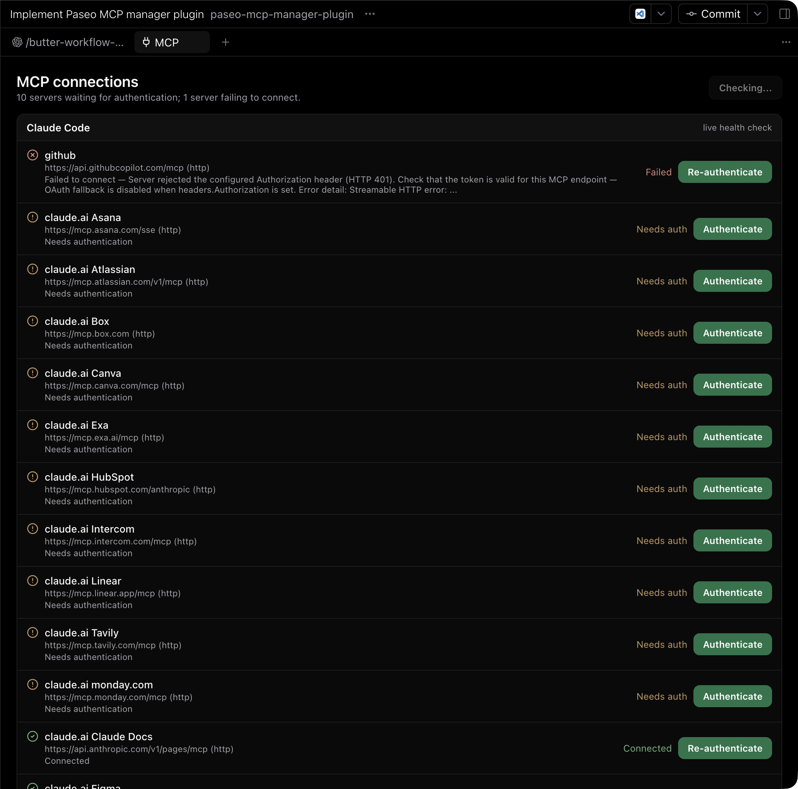

# Paseo MCP Manager

A Paseo plugin that shows the MCP servers registered with Claude Code and Codex, and starts their authentication flows, without leaving Paseo.



## What it does

- Lists the MCP servers of both providers side by side, sorted so the ones needing attention come first.
- Starts a login or re-authentication flow for servers that support one.
- Restarts the current agent session so newly granted authentication takes effect.
- Keeps one provider's result visible when the other provider fails.

## Claude Code and Codex report different things

`claude mcp list` opens a connection to every server, so its rows describe reachability. `codex mcp list` reads the local configuration and never connects, so its rows describe configuration only. The panel keeps the difference visible: the Claude section is marked **live health check**, the Codex section is marked **config only**, and an authenticated Codex row reads `Configured` rather than `Connected`.

## Requirements

- Paseo 0.8.x on the daemon host.
- The `claude`, `codex`, and `paseo` CLIs on the daemon host's `PATH`. A missing CLI is reported in its own section; the other provider still works.

## Install

Paseo plugins are trusted, unsandboxed code. The server half runs as a subprocess of the daemon, with your user's permissions on the daemon host, and can run any command that user can run — this plugin runs your provider CLIs. Install it only if you are willing to read and trust the source.

```bash
paseo plugin add ypjun100/paseo-mcp-manager-plugin
paseo plugin ls
```

Or paste `ypjun100/paseo-mcp-manager-plugin` into **Settings → Plugins → Plugin source** and select **Install plugin**. Make sure **Enable plugins** is on and the row shows `running`.

Update to a newer revision:

```bash
paseo plugin update mcp-manager
```

## Use it

1. Focus an agent tab. The panel is registered in the agent context because it needs the agent it will restart.
2. Press **⌘K** (macOS) or **Ctrl+K**, then choose **Manage MCP connections**. The MCP panel opens as a main-area tab.
3. Press **Refresh** to re-check. The list is not refetched automatically: the Claude health check contacts every server, so it stays a deliberate action.
4. Press **Authenticate** or **Re-authenticate** on a server that supports it.
   - Claude servers return an authorization URL, which opens in your Paseo client.
   - Codex has no headless login mode, so it opens a browser **on the daemon host**. On a remote daemon, that browser is not on your screen.
   - A self-hosted Claude OAuth server may additionally want the redirect URL pasted back; the toast says so and names the terminal command that finishes the job.
5. Press **Restart session to apply**, then confirm. New authentication only takes effect once the provider process reopens.

## Known limitations

- Restarting reopens the provider process for that agent. The conversation timeline is preserved; a reply still being written is interrupted.
- Adding, editing, removing, enabling, and disabling MCP servers is out of scope. Use `claude mcp` and `codex mcp` for that.
- Logging out is out of scope.
- Codex rows never claim reachability, because Codex does not report it.

## What reaches your screen

Everything a provider prints is normalised before it leaves the daemon: escape sequences and control characters are stripped, URL userinfo, query strings, and fragments are dropped, credential-shaped values are replaced with `[redacted]`, and the text is clamped to one row. Stdio servers are shown by executable name rather than full path. The Codex config fields that can hold secrets — `env`, `http_headers`, `env_http_headers`, `bearer_token_env_var` — are never read. Provider output and authorization URLs are never written to the plugin log.

## Local development

```bash
npm install
npm run check                      # unit tests, then strict typecheck
paseo plugin install "$PWD"        # install this working copy
paseo plugin ls
paseo plugin logs mcp-manager
paseo plugin reload mcp-manager
```

See [AGENTS.md](AGENTS.md) for the runtime boundaries and the rules for handling provider output.
